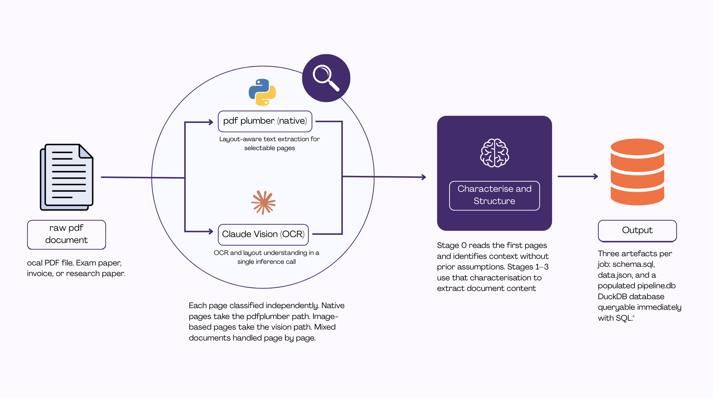

# PDF to Structured Data — ETL Pipeline

A end-to-end data engineering pipeline that ingests raw PDF documents,
extracts their content, infers a schema using an LLM, and loads the result
into a queryable database.

The pipeline handles three document types to demonstrate robustness:
exam papers, invoices, and research papers. Each has a different internal
structure, layout convention, and information density — the same pipeline
processes all three without modification.

---

## Pipeline overview




**Stage 1 — Detect and extract**
Each page is classified as native (text-selectable) or image-based (scanned).
Native pages go through `pdfplumber` for direct text extraction. Image pages
are rendered at 200 DPI and passed to Claude vision, which handles OCR and
layout understanding in a single call. Mixed documents are handled page by page.

**Stage 2 — Characterise and structure**
The extracted text is passed to Claude with a prompt that asks it to freely
describe what it sees — document type, field names, structure, layout —
and return a typed JSON object. No schema is assumed in advance. The model
infers field names, data types, and relationships from the content itself.

**Stage 3 — Load and query**
The structured JSON is validated, written to a local DuckDB database, and
made available for SQL queries. Three output artefacts are produced per document:
`schema.sql`, `data.json`, and a populated `notebook.db` you can query immediately.

---

## Design decisions

**Why not just use regex or rule-based extraction?**
PDFs have no enforced schema. Two invoices from different vendors share no
field names, layout, or formatting conventions. Rule-based extraction works
for one template and fails on the next. LLM-based extraction works on
anything human-readable.

**Why pdfplumber before vision?**
Native text extraction is fast, cheap, and lossless. Vision inference is
slower and costs more API calls. The pipeline only escalates to vision when
pdfplumber returns below a character threshold — meaning a page is scanned
or image-heavy. Most structured documents are majority-native with a minority
of scanned pages; the hybrid approach handles this without over-spending.

**Why DuckDB?**
Zero infrastructure. A single file, SQL-native, fast on analytical queries,
and works in a notebook without a running server. The same SQL you write
here runs on Postgres or BigQuery with no changes to the query logic.

**Why no fixed schema?**
Imposing a schema before seeing the data is the root cause of most extraction
pipeline failures. If the document doesn't match the schema, you get empty
fields, silent failures, or forced mappings that lose information. This pipeline
lets the model describe what it sees first, then structures around that description.

---

## What this demonstrates

- Multi-format document ingestion (native PDF, scanned PDF, mixed)
- Per-page type detection and routing
- LLM-driven schema inference from unstructured content
- Structured output validation before load
- ETL pipeline design: separation of extract, transform, and load concerns
- SQL querying of LLM-extracted data

---

## Requirements

- Python 3.11+
- An Anthropic API key

```bash
export ANTHROPIC_API_KEY=your_key_here
```

Install dependencies:

```bash
pip install -r requirements.txt
```

---

## Running the notebook

```bash
jupyter notebook notebook.ipynb
```

The notebook is self-contained. Run all cells in order. Each stage
produces visible output so you can inspect the intermediate state
before the next stage runs.

Sample PDFs are included in `sample_pdfs/`. Swap in your own documents
at the top of the notebook — no other changes needed.

---

## Limitations

- Handwritten documents are not supported
- Multi-column academic papers with complex figure layouts may produce
  partial extractions

---

## Related

This pipeline is the foundation of [Rubeeq](https://github.com/kunleowolabi/rubreeq),
a production extraction engine built specifically for exam papers — with exam body
detection, marking scheme reconciliation, profile-based extraction, and a full
platform API. 